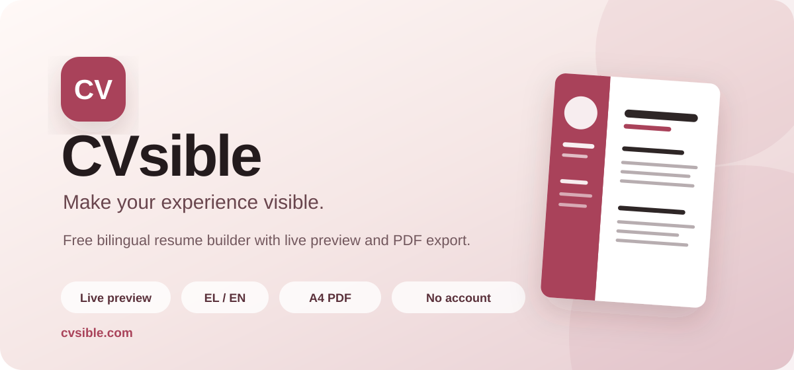

<div align="center">
  

  <br />

  <a href="https://cvsible.vercel.app/"><strong>Open the live app →</strong></a>

  <br /><br />

  
  
  
  
  
</div>

## About

**CVsible** is a free resume builder with a live preview and three ATS-safe templates. It requires no account and adds no watermark — resume data lives in the browser's `localStorage` unless you choose to sign in.

The PDF export is a real text layer, not a picture of the page: every word is selectable, searchable, and readable by an applicant tracking system, including correct Greek diacritics.

Two AI-assisted tools sit on top of the manual builder, both built as small self-checking agents rather than a single prompt call — they draft, a deterministic checker reviews the draft against the source text, and only what fails gets patched, for up to a few rounds:

- **CVisor** drafts resume wording from a job posting and whatever you write about your background. It never invents a fact, company, number, or skill that isn't in your own text — a grounding check strips anything it can't trace back to what you wrote, and you approve every suggestion before it's applied.
- **CVfix** takes a CV you already have (uploaded as PDF/DOCX/TXT) and rebuilds its *structure* into an ATS-safe layout — dates, sections, bullets — while changing **zero words** of your original wording. Every sentence in the output is verified to be a verbatim match of the source.

**CVscan** is a standalone ATS-compatibility checker: drag and drop any resume (yours or one built elsewhere) and see exactly what an ATS parser would extract — headings it recognizes, contact fields, date formats, whether it's actually two columns, whether it's an image instead of text — plus a score and the full text as the parser reads it. It runs as a purely deterministic, non-AI analysis, entirely in your browser; nothing is uploaded anywhere for the check itself.

Optionally, sign in with Google to save CVs to your account, reopen them from any device, duplicate one per job application, share a read-only link, and keep a lightweight per-CV application tracker (company/role/status/date) that never appears in the exported PDF.

The interface is available in **Greek and English**.

## Features

- Live preview while editing, with automatic multi-page A4 pagination
- Three templates — Aurora (sidebar), Meridian, Atlas (single column) — all built to canonical, ATS-recognizable section headings; switch freely without losing content
- Real vector-text PDF export: selectable, searchable, correct Greek uppercase/diacritics, real clickable links, no watermark
- **CVisor** — self-checking AI drafting agent (job posting + your background → resume content), with a grounding pass that removes anything not traceable to your own words
- **CVfix** — reformats an uploaded CV into an ATS-safe structure without changing a single word, verified automatically
- **CVscan** — standalone ATS checker: drag-and-drop PDF/DOCX/TXT, technical/factual report only (no opinions), keyword matching against a job ad, full extracted text view
- Undo/redo throughout the builder (Ctrl+Z / Ctrl+Shift+Z), with rapid edits collapsed into single steps
- Download/upload the whole resume as a JSON file, to keep editing later or move between devices without an account
- Optional **Google sign-in**: save multiple CVs to your account, reopen/duplicate/rename/delete them, a read-only public share link per CV, and a per-CV job-application tracker (company, role, status, date, notes — never exported to the PDF)
- Personal details, customizable contact links, rich-text summary, work experience/education with date validation, skills, soft skills, languages, interests, certifications and projects
- Optional profile photo with drag-to-reposition
- Drag-and-drop reordering of entries and whole sections
- Preset/custom sidebar color with automatic contrast, adjustable density and font
- Fully responsive, mobile-friendly layout
- Greek and English interface and PDF output
- No sign-up required for the core builder, no watermark, no cost

## Privacy

Full details live on the in-app [Privacy Policy](https://cvsible.vercel.app/#/privacy) and [Terms of Use](https://cvsible.vercel.app/#/terms) pages — the short version:

- Without an account, everything stays in your browser's `localStorage`; nothing reaches a CVsible server except when you actively use CVisor, CVfix, or upload a file to CVscan.
- CVisor/CVfix send the relevant text to a CVsible serverless function and from there to the Anthropic API to generate a result. That content isn't logged or permanently stored on our servers.
- CVscan's analysis of an uploaded file runs entirely client-side; the file itself is never uploaded anywhere.
- If you sign in, Supabase handles Google authentication and stores your saved CVs, protected by Postgres Row Level Security so only your account can read or write them.
- [Vercel Web Analytics](https://vercel.com/docs/analytics) and [Speed Insights](https://vercel.com/docs/speed-insights) provide anonymous, cookie-free aggregate usage data. Both are inactive during local development.

## Tech stack

- **React 19**, **TypeScript 6**, **Vite 8**
- **Vercel** for hosting, Serverless Functions (CVisor/CVfix/CVscan backend), Web Analytics and Speed Insights
- **Supabase** — Google OAuth and Postgres (saved CVs, Row Level Security, public-share links via a `security definer` function)
- **Anthropic API** — Claude Sonnet 5 for CVisor's drafting/refine loop, Claude Haiku 4.5 for CVfix and single-section wording suggestions
- **Upstash Redis** (via Vercel Storage) for per-account/per-IP rate limiting on the AI endpoints, fails open if not configured
- `pdfjs-dist` + `fflate` for client-side PDF/DOCX parsing (CVscan, CVfix)
- A from-scratch DOM-to-PDF renderer (no `html2canvas`) built on jsPDF primitives and the browser's Range API, for a pixel-accurate, fully selectable PDF text layer
- Browser `localStorage` for the no-account path

## Getting started

### Prerequisites

Install a recent supported version of [Node.js](https://nodejs.org/).

### Installation

```bash
git clone https://github.com/stavroskalyviotis/CVsible.git
cd CVsible
npm install
npm run dev
```

Open the local address shown by Vite, usually `http://localhost:5173`. The manual resume builder and CVscan's analysis work fully offline this way — but see below for the AI features and cloud save.

### Backend setup (optional)

The AI features (CVisor, CVfix) and the cloud save features (Google sign-in, My CVs) live in `api/` as **Vercel Serverless Functions**, so they aren't served by plain `npm run dev`. Either deploy to Vercel, or run [`vercel dev`](https://vercel.com/docs/cli/dev) locally instead:

```bash
npx vercel login
npx vercel link
npx vercel dev
```

`vercel dev` reads `.env.local` automatically. Create one with:

```bash
ANTHROPIC_API_KEY=            # from console.anthropic.com, with a spend limit set
VITE_SUPABASE_URL=            # Supabase project URL — Project Settings → API
VITE_SUPABASE_ANON_KEY=       # Supabase anon/public key — same page
SUPABASE_SERVICE_ROLE_KEY=    # Supabase service_role key — server-only, never expose to the browser
KV_REST_API_URL=              # optional — Vercel dashboard → Storage → add a Redis integration
KV_REST_API_TOKEN=            # optional — provided alongside KV_REST_API_URL
```

Without the Supabase keys, the app still works fully — sign-in/save simply don't appear. Without the Redis keys, CVisor/CVfix still work, just without rate limiting.

If you want Google sign-in to work, also run `supabase/schema.sql` once in the Supabase project's SQL Editor, and enable the Google provider under **Authentication → Providers** (needs a Google Cloud OAuth Client ID/Secret — see the comments at the top of `supabase/schema.sql` and the provider's own setup page for the redirect URL to register).

## Available scripts

```bash
npm run dev      # Start the development server (frontend only, see above)
npm run build    # Create a production build
npm run lint     # Run ESLint
npm run preview  # Preview the production build locally
```

## Project structure

```text
CVsible/
├── api/                     # Vercel Serverless Functions
│   ├── _lib/                # Anthropic client, agent prompts, grounding/verbatim/structure
│   │                        #   checks, rate limiting, Supabase auth verification
│   ├── cvisor-step.ts       # CVisor: one draft/refine turn per request
│   ├── cvfix.ts             # CVfix: reformat without rewording
│   ├── cvisor-suggest.ts    # Improve the wording of a single section
│   └── delete-account.ts    # Permanently deletes a signed-in user's account
├── public/fonts/            # Subsetted Latin+Greek webfonts used by the preview and PDF
├── scripts/                 # Font-subsetting pipeline and local verification tooling
├── supabase/schema.sql      # Cloud storage schema — run once in the Supabase SQL Editor
├── src/
│   ├── ats/                 # CVscan: PDF/DOCX extraction and the deterministic ATS analyzer
│   ├── auth/                # Google sign-in context, hook, and account menu
│   ├── cloud/                # Saved-CV storage (Supabase) and the per-CV application tracker
│   ├── components/          # Resume preview, forms, and reusable UI
│   ├── cvisor/               # CVisor/CVfix UI and the client-side agent loop
│   ├── data/                 # Default CV data, theme presets, density, and font options
│   ├── hooks/                 # CV state (with undo/redo), routing, and preview scaling
│   ├── i18n/                  # Greek and English translations
│   ├── legal/                 # Privacy Policy / Terms of Use content and page
│   ├── pages/                  # Landing, builder, CVscan, My CVs, public-CV pages
│   ├── pagination/             # A4 page measurement and pagination
│   ├── templates/               # Template (Aurora/Meridian/Atlas) definitions
│   ├── utils/pdf/                # The DOM-to-PDF vector rendering pipeline
│   ├── App.tsx
│   ├── main.tsx
│   └── types.ts
├── index.html
├── package.json
└── vite.config.ts
```

## How PDF export works

Exporting walks the live, already-rendered DOM of the resume preview and reconstructs it as vector PDF content — real text runs (via jsPDF), not a rasterized image. Photos and any SVG icons are the only parts rasterized to canvas; everything else, including every line of body text, is drawn as selectable, searchable text with the browser's own line-wrapping and Range API used to get pixel-accurate positioning.

This is why the exported PDF's text layer matches the on-screen render 1:1 and is fully machine-readable by an ATS — unlike a picture-of-the-page export, or the inconsistent margins/extra blank pages that browser and OS print pipelines can add.

## Possible next steps

- [ ] Custom free-text CV sections
- [ ] Collapsible builder panel for a full-screen preview on tablets
- [ ] Automated accessibility tests
- [ ] Unit and end-to-end tests

## Author

Created by **Stavros Kalyviotis**.

[LinkedIn](https://www.linkedin.com/in/stavros-kalyviotis/) · [Live application](https://cvsible.vercel.app/)
